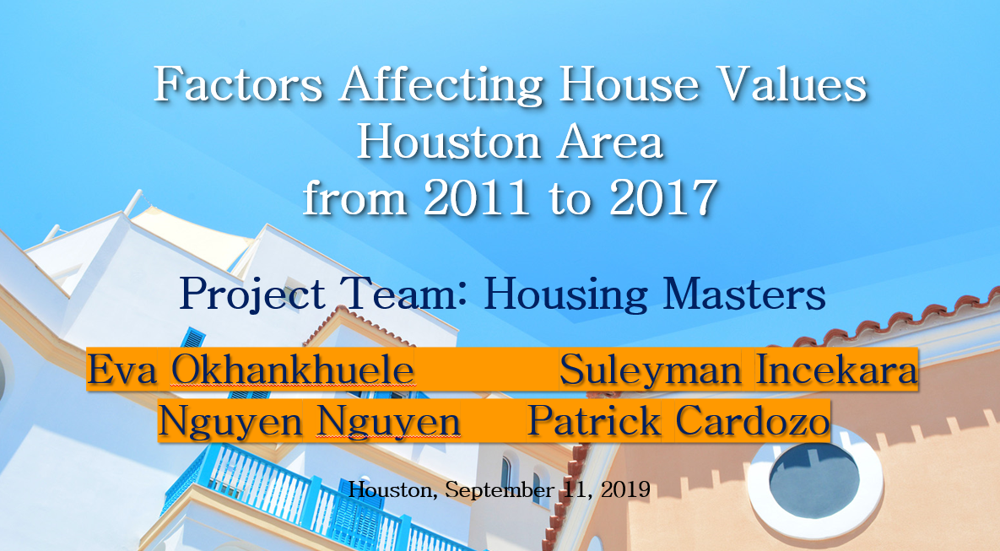
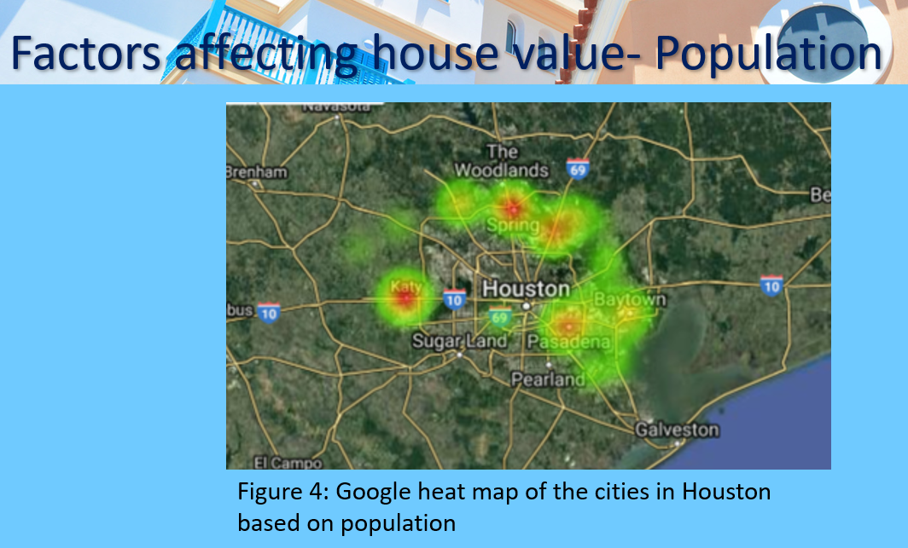
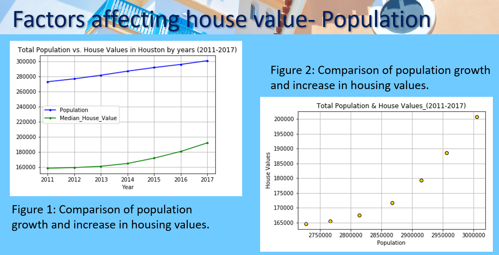
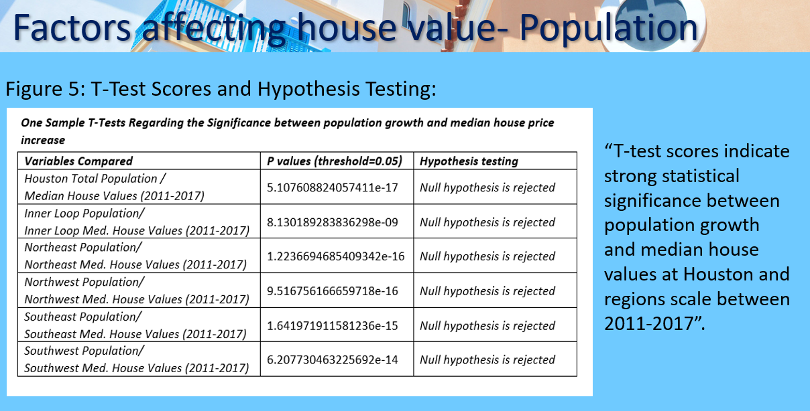

# Project Outcomes

House’s values in Houston Area are generally higher than average in Harris County. In which, Inner Loop and Southwest are most expensive

# Monthly housing costs 

in Houston Area is cheaper than average, positively affect house values, making a stronger impact in Houston Area. However, the strength of correlation declines over time. 
One exception is Northwest region where the correlation is very weak.

# Household income

Houshold income in Houston area is generally below average compared to Harris County. However, Inner Loop has higher income and Southwest is about equal to Harris County average.
House hold income strongly and positively affects house values. The degree of impact seems stable over time.

# Population and house values
There is a strong statistical significance between population growth and median house values at Houston

#Time travel to work
Traveling time to work weakly negatively affects house’s value. Degree of impact declines over time

# What was my contribution to the project?
In this project, I have investigated whether there was a statistical signifigance between population and median house values at the research area. 

## The tools used for the analysis
* Jupyter Notebook was the main tool used throughout the analysis including:
  * Fetching the  population of data (2011-2017) from U.S. Census Bureau by using API calls,
  * Creating data frames and storing the results, cleaning and preparing the data for consumption,
  * Merging the populatin tables based on the years,
  * Grouping the city zipcodes to create 5 regions considering their population and mean house values,
  * Applying T-Tests to find out the signifigance between the population values and median house values between 2011 and 2017,
  * Finding the percent change of the population in each five regions created (Inner Loop, Northeast, Northwest, Southeast, and Southwest), and
  * Creating line and scatter plots regarding the relation ship between population increase and house value increase.
* Jupyter Notebook is also used to create a heatmap of the Cities in Houston area based on their population and zipcodes.

## Outcomes of the population ad housing values analysis
* Line and scatter plots showed the strong corelation between increasing population and mean house values in the research area.

* T-test scores indicated a strong statistical signifigance between population growth and median house values between 2011 and 2017.

* Southwest and Northwest regions were the two regions experiences fastest population growth and house values increase in the given regions.
